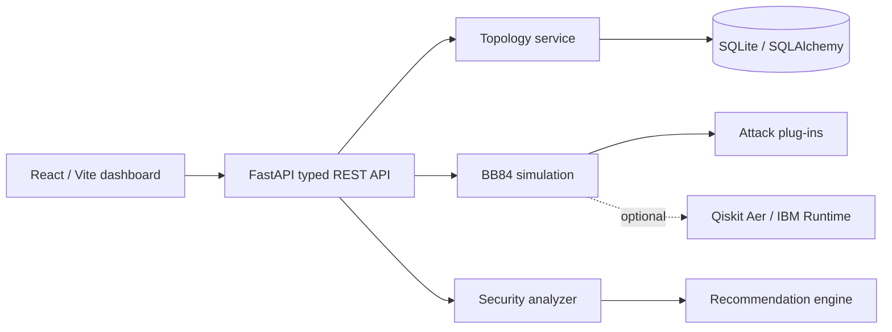
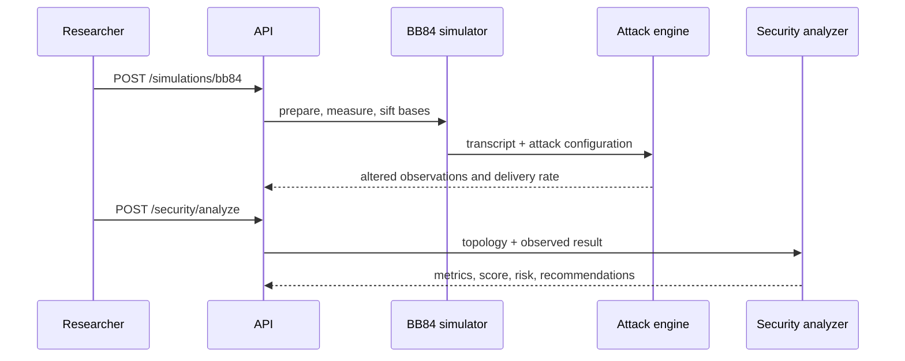

# Architecture

QSecNet uses a layered architecture so protocol, attack, analysis, and HTTP
concerns remain independently testable.

## Package responsibilities

| Package | Responsibility |
| --- | --- |
| `backend/api` | Validation, OpenAPI schemas, and REST endpoints |
| `backend/simulator` | BB84 protocol execution and transcript generation |
| `backend/attacks` | Extensible channel and adversary perturbations |
| `backend/analyzer` | QBER, graph, reliability, and score calculations |
| `backend/recommendation_engine` | Metric-driven remediation guidance |
| `backend/database` / `models` | SQLAlchemy persistence lifecycle and entities |

## BB84 analysis sequence

The core BB84 implementation is protocol-level and deterministic for a supplied
seed. Qiskit Aer and IBM Runtime remain optional extras because hardware access
requires user-managed credentials and queue availability.
