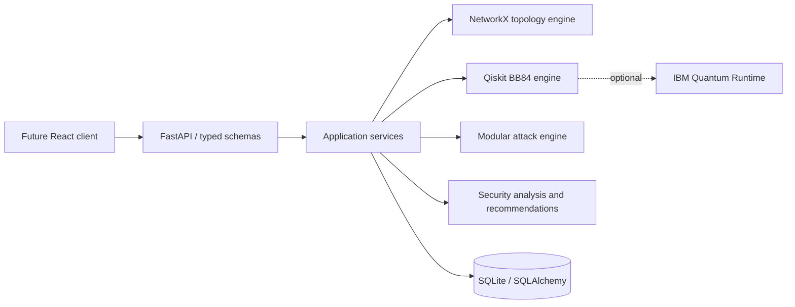

# QSecNet architecture

QSecNet follows a layered, backend-first architecture.

## Boundaries

- `api`: HTTP routing, validation, status codes, and API schemas.
- `models` and `database`: persistence entities and database sessions.
- `simulator`, `attacks`, `analyzer`, `recommendation_engine`: pure domain logic.
- `utils`: shared cross-cutting concerns only.

Dependencies point inward: HTTP and persistence adapt the domain; domain modules do not import FastAPI or database sessions.

## Persistence

SQLite is the development default. Alembic owns versioned schema changes in `migrations/`; the initial schema models projects, versioned topologies, nodes, quantum links, simulations, attacks, security reports, and recommendations.

## Operational safeguards

- All API requests receive an `X-Request-ID` correlation header and produce structured JSON logs.
- Request-validation failures use FastAPI's typed `422` response; unhandled errors receive a non-sensitive `500` response with an error ID.
- The Docker command runs `alembic upgrade head` before accepting traffic.
